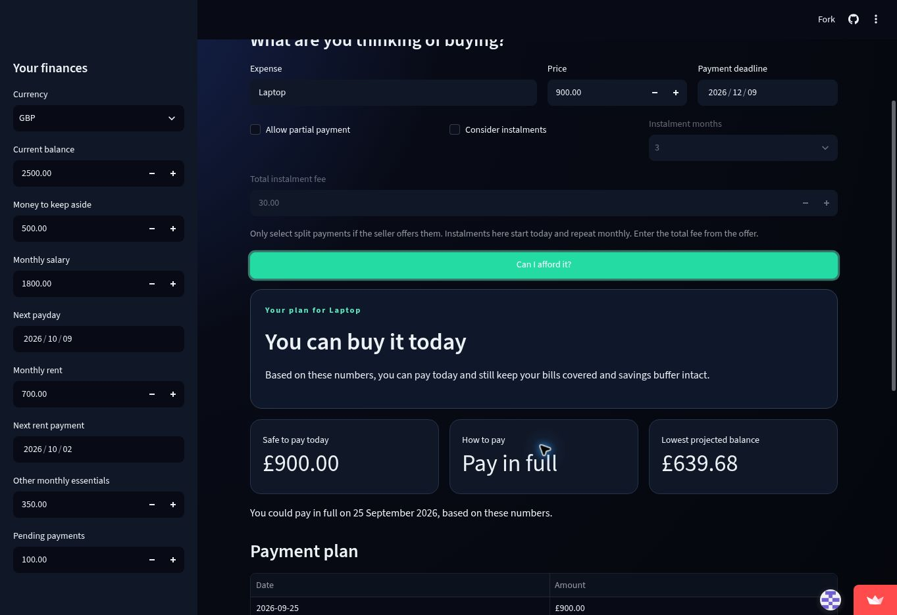
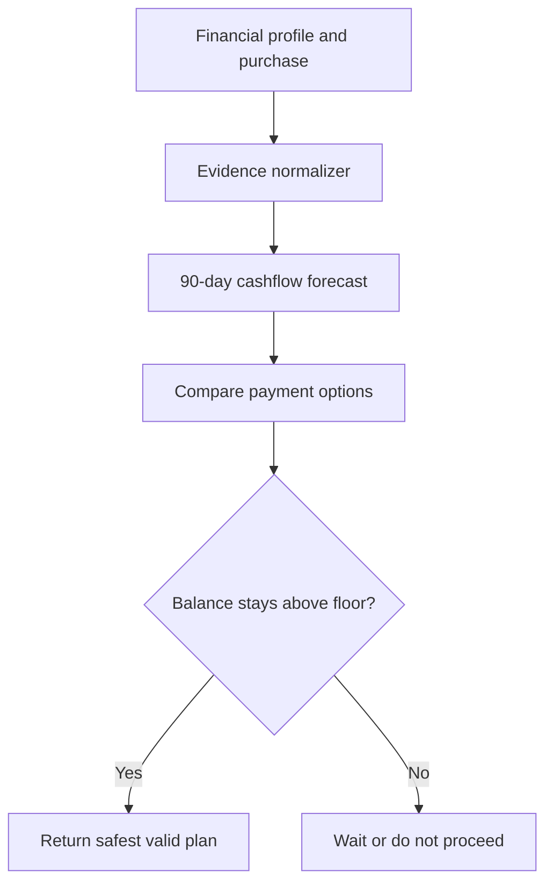
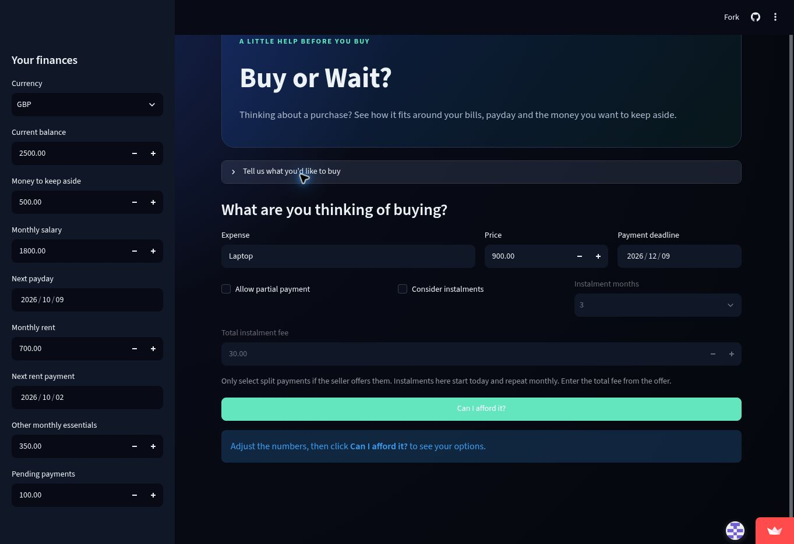
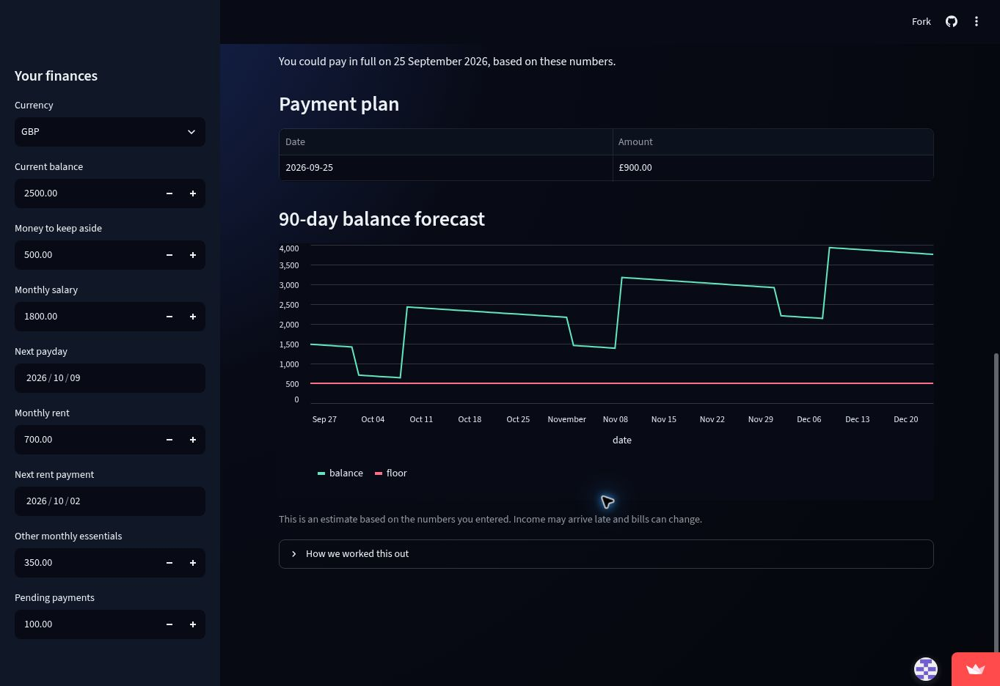

# Buy or Wait?

[](https://github.com/tayebakhan/buy-or-wait/actions/workflows/tests.yml)
[](https://github.com/tayebakhan/buy-or-wait/actions/workflows/baseline.yml)
[](https://www.python.org/)
[](https://buy-or-wait-xf8arqodck2gxvkesbckb5.streamlit.app/)

An AI-assisted financial planning agent that answers a practical question: **can I safely afford this purchase?**

Instead of checking only the current balance, it forecasts income, bills, essential spending, pending payments and a user-selected safety buffer. It then recommends paying in full, splitting the payment, using an available instalment offer, waiting, or not proceeding.

[Try the live app](https://buy-or-wait-xf8arqodck2gxvkesbckb5.streamlit.app/) | [Watch the 10-second demo](docs/demo.mp4)



## The problem

A bank balance can look healthy while rent, bills and other commitments are about to leave the account. Two people with the same balance may also need different advice because their income dates, minimum balance preferences and flexible expenses are different.

Buy or Wait turns those details into a personalized 90-day forecast and a payment recommendation that must satisfy three rules:

- The complete payment plan is achievable.
- Essential expenses remain covered.
- The projected balance never falls below the user's chosen minimum.

## What it returns

| Output | Meaning |
| --- | --- |
| `amount_safe_to_pay` | Maximum safe amount to pay today |
| `affordability_status` | Affordable now, with a plan, later, or not within the forecast |
| `recommended_payment_method` | Safest available way to pay |
| `payment_plan` | Recommended dates and amounts |
| `earliest_date_for_full_payment` | First safe date for one full payment |
| `spending_changes_needed` | Optional expenses to stop or reduce |
| `decision_explanation` | Short reason for the recommendation |

## How it works



1. The agent joins each request to the user's financial profile, settled events, payment options, messages and linked images.
2. It normalizes dated foreign-currency events and rejects unsafe evidence such as pending income, failed payments and unrealized investment values.
3. It learns recurring patterns from settled history and builds a daily 90-day cashflow forecast.
4. It tests full payment, exactly two partial payments, supplied instalment offers, waiting and up to three allowed spending changes.
5. It rejects any plan that misses the deadline or takes the balance below the user's safety floor.
6. It writes and validates the exact challenge output schema.

All money calculations use Python `Decimal`. AI is used to extract purchase or evidence details from natural language and images. The affordability decision itself is deterministic, testable and explainable.

## Product experience

The Streamlit app supports manual entry without an API key. With Gemini configured, a user can also write a request such as “Can I buy a £900 laptop before 9 December?” and optionally attach a product listing, bill or receipt.

| Purchase details | Recommendation | Forecast |
| --- | --- | --- |
|  |  |  |

## Measured results

The reproducible public evaluation runs all 25 solved sample requests from the original challenge. These are measured results, not claims about hidden test data.

| Metric | Result |
| --- | ---: |
| Affordability status accuracy | 80% |
| Recommended payment method accuracy | 84% |
| Payment plan accuracy | 80% |
| Earliest full-payment date accuracy | 84% |
| Amount within 5% of request | 88% |
| Mean request-normalized amount error | 2.95% |
| Automated tests | 21 passing |

Exact monetary equality is the main remaining improvement area. The evaluation pipeline reports exact-row accuracy, per-field accuracy and normalized amount error so future changes can be compared without hardcoded answers.

## Run locally

Requires Python 3.12.

```bash
git clone https://github.com/tayebakhan/buy-or-wait.git
cd buy-or-wait
python3 -m venv .venv
source .venv/bin/activate
python3 -m pip install -r requirements.txt
python3 -m streamlit run app.py
```

Manual entry works immediately. To enable AI extraction, create `.streamlit/secrets.toml`:

```toml
GEMINI_API_KEY = "your-key-from-google-ai-studio"
GEMINI_MODEL = "gemini-2.5-flash"
```

Never commit a real key. The app sends only the purchase message, optional uploaded image, current date and currency context to Gemini. Sidebar balances and bills are not sent.

## Run the batch agent

Download the original challenge data and place the CSV files and `media/` folder inside `dataset/`. The dataset is intentionally excluded from this repository.

```bash
python3 code/main.py --dataset dataset --output output.csv
```

The command validates required files, input columns, output column order, request IDs, labels, dates, payment plans and spending changes.

If an event amount exists only in an image, set `GEMINI_API_KEY` or add a human-verified value to `dataset/evidence_cache.json`:

```json
{
  "image_01": {"amount": "1250.00"}
}
```

## Evaluate and test

```bash
python3 evaluation/evaluate.py \
  --predictions sample_output.csv \
  --expected dataset/sample_requests.csv

python3 -m unittest discover -s tests -v
```

The evaluator creates Markdown and JSON reports. Equivalent money formats such as `100` and `100.00` are treated as equal, while free-text explanations are excluded from exact matching.

## Repository guide

```text
app.py                       Streamlit interface
engine.py                    Interactive recommendation engine
forecast.py                  Daily balance simulation
scenario.py                  Typed scenario models
buy_or_wait/batch.py         Challenge dataset agent
code/main.py                 Batch command-line entry point
evaluation/                  Reproducible scoring and evidence tools
tests/                       Unit and integration tests
docs/                        Screenshots, demo and portfolio copy
```

## Safety and limitations

- This project does not connect to a bank or move money.
- Results are estimates based on supplied information and are not financial advice.
- Pending income, failed payments and unrealized assets are not treated as spendable cash.
- Image extraction requires Gemini or a reviewed local cache.
- Unsupported message wording may require a richer evidence normalizer.

## Origin

Started from the [HackerRank Orchestrate Buy or Wait challenge](https://github.com/interviewstreet/hackerrank-orchestrate-september26) and continued as an independent portfolio project.
